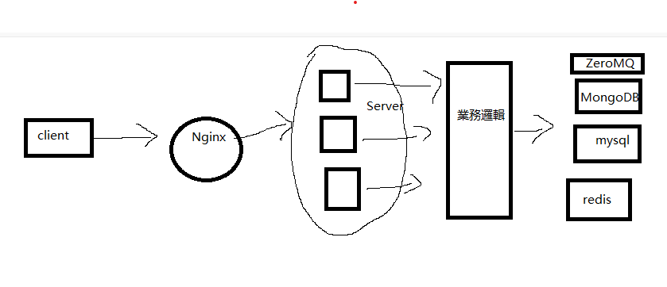

# 服務器概念

一個服務器最基本要有的功能：

- 登錄註冊
- 聊天/發送圖片/發送語音 
- 心跳包 （維持tcp連接，如果客戶端用電話，不斷發送心跳包，對方的手機會發熱過度，因為心跳包的發送非常耗電）


# 數據庫

用戶信息要存在數據庫

主流手法 MySQL + Redis

MySQL對應持久化存儲，Redis對應快速存儲，Redis是cache，一旦斷電信息全無。

主流實現方法：


```
    1. {
        write_to_redis(msg);
        write_to_mysql(msg);
    }
    2. {
        write_to_mysql();
            //讓mysql 透過中間組件實現
            mysql{
                mysql_sync_redis();
            }
    }
```


# 多台服務器情景下的，數據同步

消息隊列 message queue

ZeroMQ 就是其中一個開源的框架

它採用 訂閱發佈設計模式， 只要有消息進入其中一台服務器，就會被註冊到MQ，透過MQ作為消息的發佈者。


# 後端整體流程




