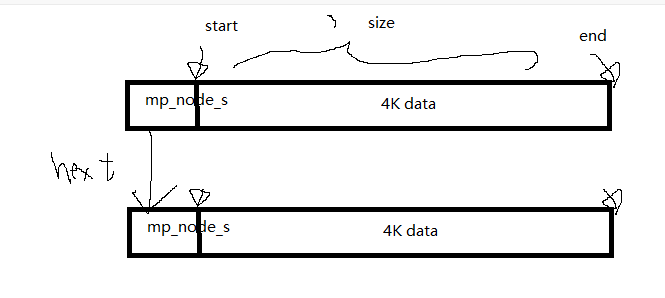

# 內存池優化

服務器每次進行io，當需要用到malloc的時候，都會有消耗，利用內存池提前把內存開闢，需要用時候進行分配，減少malloc和free的次數。

這個內存池參考Nginx的內存池，代碼使用C來完成。


# 如何實現一個內存池？

內存池是一個組件，做出來之後提供給別人使用。

1. 利用macro來處理
2. 利用struct定義，基礎的數據結構
3. 對應的函數，對外提供api結構
4. 測試函數

對內存池的實現只依賴與3個結構體

```
struct mp_pool_s {
    size_t max;
    struct mp_node_s *current;
    struct mp_large_s  *large;

    struct mp_node_s head[0]; // <-  這個數據不佔任何內存，他只是一個標籤
};

struct mp_large_s{
    struct mp_large_s *next;
    void *alloc;
};

struct mp_node_s{
    unsigned char *start;
    unsigned char *end;

    struct mp_node_s *next;
    int flag;
};
```

主要的method

1. create pool，init
2. destory pool
3. malloc/calloc
4. free


# 一些C 的函數
```
用來分配小塊內存的函數
malloc()

用來分配大塊內存的函數
posix_memalign()
```


# 內存池的結構體

1. 小塊內存: < 4K
2. 大塊內存: > 4K

# 如何把小塊組織成一個4K內存塊 struct   mp_node_s





如果4K用完，我們就開闢下一個4K，並且用鏈錶形式把他們串聯在一齊，要釋放的時候我們不會call free，而是放回進鏈錶中。

# 如何組織大塊內存

比如說今天有一個流媒體進入，一段影片。

對於大塊組織我們會使用lazy construct的方式，要用才分配，然後不釋放留給memory pool
作為調用資源。

！ 對於使用者來說接口是統一的，他不需要知道自己應該調用大塊內存分配還是小塊。


# 如何釋放

如何知道小內存塊中是否都已經清楚了呢？

我們可以透過flag， flag 每次申請內存都會加1，當flag為0才可以釋放，整個free掉